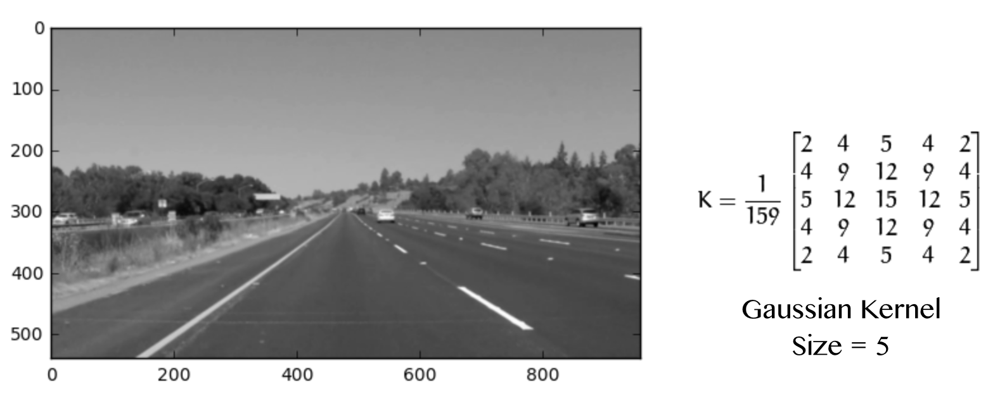

## Self-Driving Car  
## Lane Recognition

### Ivy Lu

---

### Introduction

- Identify Lane in Images
- *Python* and *OpenCV* Packages

---

### Step 1: Turn Image to Grayscale

- Reduce complexity
- color doesn't help much in solving this problem

---

### Step 2: Gaussian Smoothing

- Suppressing noise, reduce details
- Low-pass filter, reduce high-frequency components
- Convolving image with Gaussian function

---
 
### Step 3: Canny Edge Detection

- **Low error rate**: good detection of only existent edges
- **Good localization**: close to real edge pixels 
- **Minimal response**: only one response per edge

---

### Step 4: Create Mask 

- Assumption: fixed camera

---

### Step 5: Hough Transform

**y = mx + b**    =>    **b = -xm + y**

Find points in Hough space where multiple lines cross

 

---

### Step 6: Draw Line

- Connect, Average, Extrapolate

